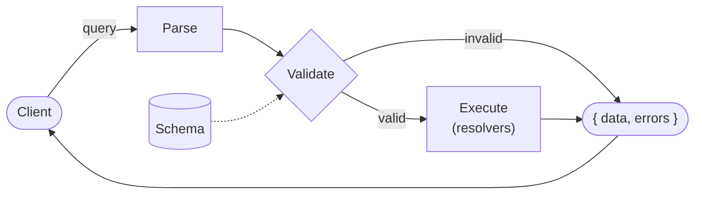
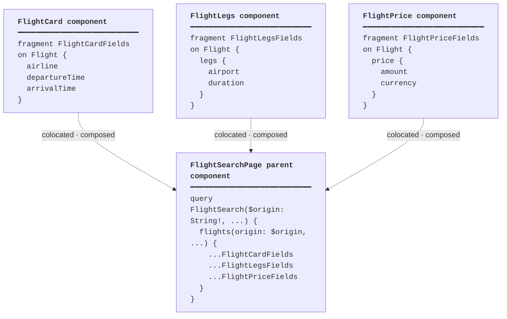
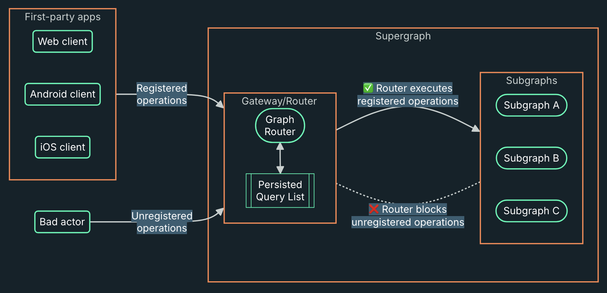

# Why we're here

🤔

<!-- end_slide -->

# Why we're here

We want to make...

- better user experiences
- better apps
- better agents

**GraphQL** is the investment to make in 2026

<!-- end_slide -->

# I need your help

<!-- end_slide -->

# The dream query

<!-- column_layout: [1, 1] -->

<!-- column: 0 -->

```graphql
query FlightSearch {
  flights(origin: "JFK", destination: "LHR", date: "2026-06-01") {
    airline
    departureTime
    arrivalTime
    legs {
      airport
      duration
    }
    price {
      amount
      currency
    }
  }
}
```

<!-- column: 1 -->

A GraphQL query that contains an ideal representation of the data needed to create a full user experience

<!-- reset_layout -->

<!-- end_slide -->

# Query anatomy

<!-- column_layout: [1, 1] -->

<!-- column: 0 -->

```graphql
query FlightSearch {
  flights(origin: "JFK") {
    airline
    legs {
      airport
      duration
    }
  }
}
```

<!-- column: 1 -->

**operation type** — `query`, `mutation`, `subscription`

**operation name** — optional, but always use one

**field** — a named piece of data

**argument** — parameterizes a field

**selection set** — `{ }` — describes the shape you want back

**nesting** — fields can contain fields

<!-- reset_layout -->

<!-- new_line -->

The response mirrors the shape of the query.

<!-- end_slide -->

# Introducing myself

<!-- column_layout: [2, 1] -->

<!-- column: 0 -->

```graphql
query TalkIntro {
  me {
    name
    title
    company
    bio
    socials {
      github
      bluesky
      linkedin
    }
  }
}
```

<!-- column: 1 -->


<!-- reset_layout -->

<!-- end_slide -->

# GraphQL is

<!-- end_slide -->

# GraphQL is

... just a spec

:(

<!-- end_slide -->

# GraphQL is

... just a spec

:)

<!-- end_slide -->

# GraphQL is

- "just" a spec
- a means of expressing your domain objects
- a way to get new experiences, apps, and agents off the ground quickly

<!-- end_slide -->

# Learn GraphQL in 2026

## an anti-blueprint

This talk...

- is spontaneous and social
- focuses on basics and questions, not complexity and answers
- uses a prompt-driven narrative to match modern dev practices

<!-- end_slide -->

# Make the dream a reality

<!-- end_slide -->

# Schema

<!-- column_layout: [3, 2] -->

<!-- column: 0 -->

```graphql
type Query {
  flights(origin: String!, destination: String!, date: String!): [Flight!]!
}

type Flight {
  airline: String!
  departureTime: String!
  arrivalTime: String!
  legs: [Leg!]!
  price: Price
}

type Leg {
  airport: String!
  duration: Int!
}

type Price {
  amount: Float!
  currency: String!
}
```

<!-- column: 1 -->

**type** — a named object in your domain

**field** — a typed piece of data on a type

**scalar** — leaf type — `String`, `Int`, `Float`, `Boolean`, `ID`

**`!`** — non-null — the field will always have a value

**`[ ]`** — list

**arguments** — typed inputs declared on a field

<!-- reset_layout -->

<!-- new_line -->

Every field selected in the query has a definition here. The schema defines what's _possible_; the query picks what it _wants_.

<!-- end_slide -->

# Descriptions

<!-- column_layout: [3, 2] -->

<!-- column: 0 -->

```graphql
"A scheduled airline flight between two airports."
type Flight {
  "Two-letter IATA code, e.g. `AA`, `BA`."
  airline: String!

  "ISO 8601 timestamp in the origin airport's local time."
  departureTime: String!

  """
  All segments of the journey, in order.
  A direct flight has exactly one leg.
  """
  legs: [Leg!]!

  "Null when pricing isn't available for this passenger."
  price: Price
}
```

<!-- column: 1 -->

**`"..."`** — single-line description

**`"""..."""`** — multi-line, markdown-friendly

Lives on **types**, **fields**, **arguments**, **enum values** — anywhere in the schema

**Introspectable** — IDEs, codegen, docs, and agents all read it

**Lintable**: enforce descriptions to make sure your API is well-annotated

<!-- reset_layout -->

<!-- new_line -->

In 2026 your schema is read by humans **and** agents. A well-described schema is a well-prompted agent.

<!-- end_slide -->

# Resolvers

<!-- column_layout: [3, 2] -->

<!-- column: 0 -->

```ruby
class Types::QueryType < Types::BaseObject
  field :flights, [Types::FlightType], null: false do
    argument :origin, String, required: true
    argument :destination, String, required: true
    argument :date, String, required: true
  end

  def flights(origin:, destination:, date:)
    HTTP.get(
      "http://service-1/flights",
      params: { origin:, destination:, date: }
    ).parse
  end
end
```

<!-- column: 1 -->

**resolver** — a function that returns data for a field

**field** — declared once in the schema, implemented once as a method

**arguments** — arrive as keyword arguments, already typed and validated

**body** — plain runtime code (Ruby in this case) — call a database, a REST API, another service

<!-- reset_layout -->

<!-- new_line -->

The schema says _what_ `flights` returns. The resolver says _how_ to get it. GraphQL doesn't care what's underneath.

<!-- end_slide -->

# Anatomy of a GraphQL request



<!-- new_line -->

**Validate before execute** — bad queries never reach your resolvers.

**Query shape == response shape** — the client picks; the server delivers exactly that.

<!-- end_slide -->

# Changing data with mutations

<!-- end_slide -->

# Mutations

<!-- column_layout: [3, 2] -->

<!-- column: 0 -->

```graphql
mutation BookFlight($flightId: ID!, $passengerId: ID!) {
  bookFlight(
    flightId: $flightId,
    passengerId: $passengerId
  ) {
    booking {
      id
      status
    }
  }
}
```

<!-- column: 1 -->

- Same structure as a query — operation type, name, selection set
- For writes: creates, updates, deletes
- Returns data too — no need for a follow-up request

<!-- reset_layout -->

<!-- end_slide -->

# Resolving mutations

<!-- column_layout: [3, 2] -->

<!-- column: 0 -->

```go
func (r *mutationResolver) BookFlight(
    ctx context.Context,
    flightID, passengerID string,
) (*BookFlightPayload, error) {
    body, _ := json.Marshal(map[string]string{
        "flightId":    flightID,
        "passengerId": passengerID,
    })
    resp, err := http.Post("http://service-2/bookings", "application/json", bytes.NewReader(body))
    if err != nil {
        return nil, err
    }
    defer resp.Body.Close()

    var booking Booking
    json.NewDecoder(resp.Body).Decode(&booking)
    return &BookFlightPayload{Booking: &booking}, nil
}
```

<!-- column: 1 -->

- Not the same as HTTP verbs
- Still resolvers — plain code, any language (here: Go + gqlgen)
- Same wiring as a query resolver — just write semantics
- Return the new state so the client doesn't need a follow-up read

<!-- reset_layout -->

<!-- end_slide -->

# Variables

Parameterize an operation — separate the document from the runtime values.

```graphql
mutation BookFlight($flightId: ID!, $passengerId: ID!) {
  bookFlight(
    flightId: $flightId,
    passengerId: $passengerId
  ) {
    booking {
      id
      status
    }
  }
}
```

```json
{
  "flightId": "AA42",
  "passengerId": "u_8821"
}
```

<!-- new_line -->

`$variableName: Type` — declared at the top, passed separately at runtime.

<!-- end_slide -->

# Learning through schema design

With your agent...

1. Try to describe your data
2. Determine the best way to interact with your systems
3. Collaborate before committing
4. Some prefer schema-first, others code-first

<!-- end_slide -->

# Questions you'll be prompting later

<!-- end_slide -->

# How should I use fragments?

## Questions you'll be prompting later



<!-- end_slide -->

# How is GraphQL typesafe for `$MY_LANGUAGE`?

## Questions you'll be prompting later

<!-- column_layout: [1, 1] -->

<!-- column: 0 -->

```graphql
# FlightSearch.graphql
query FlightSearch($origin: String!) {
  flights(origin: $origin) {
    airline
    departureTime
    legs {
      airport
      duration
    }
  }
}
```

<!-- column: 1 -->

```swift
// FlightSearchQuery.swift  (generated)
class FlightSearchQuery: GraphQLQuery {
  let origin: String

  struct Data: SelectionSet {
    let flights: [Flight]

    struct Flight: SelectionSet {
      let airline: String
      let departureTime: String
      let legs: [Leg]

      struct Leg: SelectionSet {
        let airport: String
        let duration: Int
      }
    }
  }
}
```

<!-- reset_layout -->

<!-- new_line -->

Code generation tools read your GraphQL operations + the schema and emit strongly-typed code (in this case: Swift). Change the query, regenerate, the compiler catches every broken consumer.

<!-- end_slide -->

# How is GraphQL typesafe for `$MY_LANGUAGE`?

## Questions you'll be prompting later

> [!CAUTION]
> Some additions may not be backwards compatible with clients.  Even `enum` additions!

<!-- column_layout: [1, 1] -->

<!-- column: 0 -->

```graphql
# V1
enum Example {
  FOO
  BAR
}
```

<!-- column: 1 -->

```graphql
# V2
enum Example {
  FOO
  BAR
  BAZ
}
```

<!-- reset_layout -->

<!-- end_slide -->

# How should I secure my deployment?

## Questions you'll be prompting later

- Persisted queries / trusted documents
- Rate/depth limiting
- Traffic shaping
- No introspection in production

<!-- end_slide -->

# How should I secure my deployment?

## Questions you'll be prompting later



<!-- end_slide -->

# What performance best practices should I mind?

## Questions you'll be prompting later

- Persisted queries / trusted documents
- DataLoader (N+1 problem)
- Client-side caching
- Server/router-side caching
- Incremental delivery

<!-- end_slide -->

# How do I practice context engineering with GraphQL?

## Questions you'll be prompting later

- OSS GraphQL MCP Servers are out there
- OSS Agent Skills for GraphQL are available
- Semantic Introspection is an exciting development
- MCP Tools for various GraphQL tools

<!-- end_slide -->

# Slides


<!-- end_slide -->

# Thanks!

- GraphQL Foundation and TSC
- Apidays / FOST / Mehdi for partnering
- Apollo for funding my travel and lodging here
- Everyone here today for making this a reality
